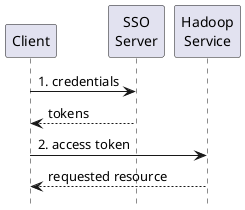

```
/knox
  /{cluster}
    /conf
      /gateway-site.xml
      /log4j.properties
      /security
        /master
        /registry
        /keystores
          /__gateway-credentials.jceks
          /gateway.jks
          /{topology}-credentials.jceks
    /deployments
      /{topology}.xml
```

